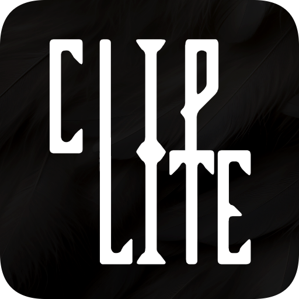

# ClipLite

  

  

  **The Lightweight Clipping Software.**

Replay buffer recorder for Windows. Runs in the background and saves the last N seconds of your screen and audio as an MP4 whenever you press a hotkey.

## Download

Get `cliplite.exe` from the [Releases](../../releases/latest) page. No installer.

**Requirements:** Windows 10 or 11 (64-bit).

## Usage

1. Run `cliplite.exe` — a tray icon appears in the taskbar.
2. Press the hotkey (default: `Ctrl+Alt+F10`) to save a clip to `%USERPROFILE%\Videos\Cliplite`.
3. Right-click the tray icon to configure:

| Option | Description |
|---|---|
| Clip Duration | Buffer length: 30 s – 5 min |
| Enable Microphone | Toggle mic audio in clips |
| Change Hotkey | Press any key combo to assign it |
| Open Save Folder | Open the output folder in Explorer |
| Open Config File | Edit `%APPDATA%\Cliplite\config.json` directly |
| Start with Windows | Run ClipLite at login |
| Quit | Exit |

Config is saved on exit.

## Notes

- System audio (loopback) is always recorded. Mic is optional.
- Hotkeys: any Ctrl/Alt/Shift/Win + key combination, or a bare F1–F24 key.
- Captures the primary monitor only, including fullscreen and hardware-accelerated content.
- Uses hardware H.264 encoding if available (Quick Sync, NVENC, AMF); falls back to the Windows built-in software encoder otherwise.

## Building

Requires Visual Studio 2022, CMake 3.20+, Ninja, and [WTL 10](https://sourceforge.net/projects/wtl/) extracted to `third_party/wtl/`. Then run `build.bat`.

## License

[MIT](LICENSE)
